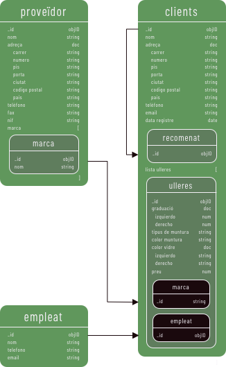
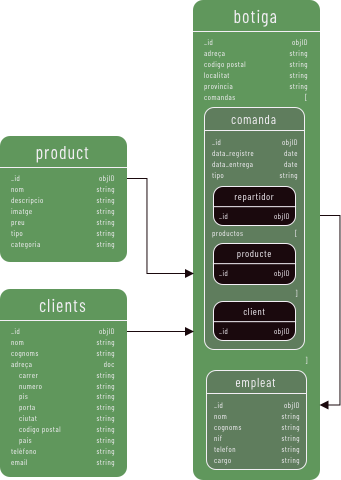
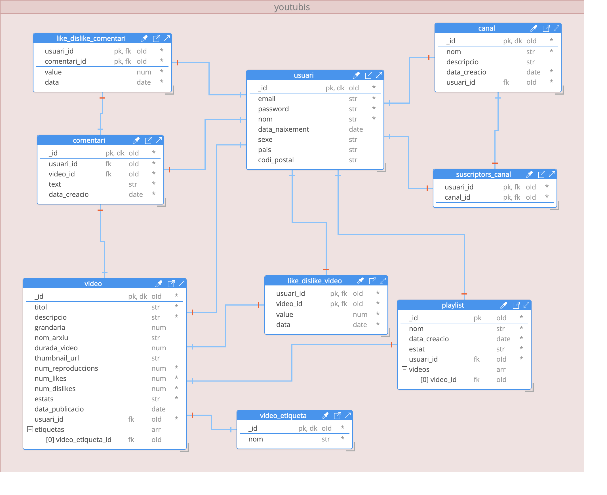

# Descripción

Modelado de diversos diagramas entidad-relación para base de datos en mongoDb.

<!-- ### Docker
Archivo docker para levantar un servidor de MongoDB. En un terminal acceda a la carpeta de docker y levante la instancia. Comandos:

```
cd docker
docker compose up
``` -->

## Ejercicio 1: Optica
Archivos
- [MongoDB_model_optica.hck.json](./optica/MongoDB_model_optica.hck.json): Modelo definido utilizando Hackolade
- [optica-tablas.png](./optica/optica-tablas.png): Imagen del modelo definido



## Ejercicio 2: Pizzeria
Archivos
- [MongoDB_model_pizzeria.hck.json](./pizzeria/MongoDB_model_pizzeria.hck.json): Modelo definido utilizando Hackolade
- [pizzaria-tablas.png](./pizzeria/pizzaria-tablas.png): Imagen del modelo definido



<!-- ### Ejercicio 3: Youtube
Archivos
- [MongoDB_model_youtube.hck.json](./youtube/MongoDB_model_youtube.hck.json): Modelo definido utilizando Hackolade
- [youtube_mongodb_script_shell.js](./youtube/youtube_mongodb_script_shell.js): MongoDb script
- [youtube_mongodb_sample_data_shell.js](./youtube/youtube_mongodb_sample_data_shell.js): Ejemplo de dato a ser insertado
- [youtube.png](./youtube/youtube.png): Imagen del modelo definido

-->

## Programas utilizados
- [Hackolade](https://hackolade.com/): Programa para modelaje de la base de datos
- [MongoDB Compass](https://www.mongodb.com/es/products/compass): Programa utilizado para conectar con la base de datos de modo grafico y por shell
- [Sketch](https://www.sketch.com/): Programa utilizado para diseñar las tablas.
- [Docker](https://www.docker.com/): Programa utilizado para levantar el servidor MongoDb 

## Referencias utilizadas
- [Data Modeling with MongoDB](https://www.youtube.com/watch?v=3GHZd0zv170)
- [MongoDB Schema Design Best Practices](https://www.youtube.com/watch?v=leNCfU5SYR8)
