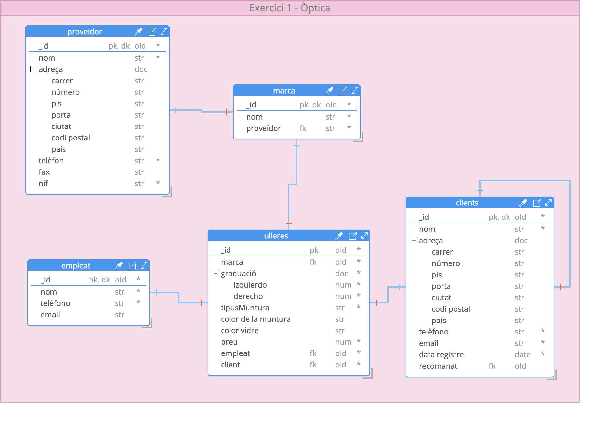
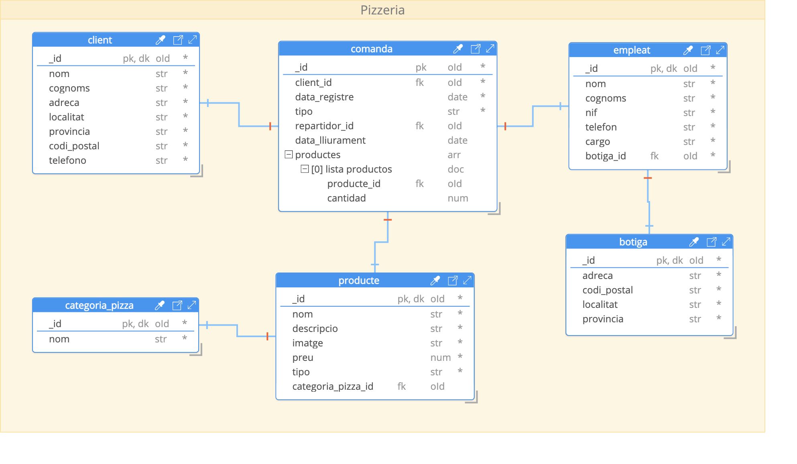

# Descripción

Modelado de diversos diagramas entidad-relación para base de datos en mongoDb.

## Contenido

### Docker
Archivo docker para levantar un servidor de MongoDB. En un terminal acceda a la carpeta de docker y levante la instancia. Comandos:

```
cd docker
docker compose up
```

### Ejercicio 1: Optica
Archivos
- [MongoDB_model_optica.hck.json](./optica/MongoDB_model_optica.hck.json): Modelo definido utilizando Hackolade
- [optica_mongodb_script_shell.js](./optica/optica_mongodb_script_shell.js): MongoDb script
- [optica_mongodb_sample_data_shell.js](./optica/optica_mongodb_sample_data_shell.js): Ejemplo de dato a ser insertado
- [optica.png](./optica/optica.png): Imagen del modelo definido


### Ejercicio 2: Pizzeria
Archivos
- [MongoDB_model_pizzeria.hck.json](./pizzeria/MongoDB_model_pizzeria.hck.json): Modelo definido utilizando Hackolade
- [pizzeria_mongodb_script_shell.js](./pizzeria/pizzeria_mongodb_script_shell.js): MongoDb script
- [pizzeria_mongodb_sample_data_shell.js](./pizzeria/pizzeria_mongodb_sample_data_shell.js): Ejemplo de dato a ser insertado
- [pizzeria.png](./pizzeria/pizzeria.png): Imagen del modelo definido


### Ejercicio 3: Youtube
Archivos
- [MongoDB_model_youtube.hck.json](./youtube/MongoDB_model_youtube.hck.json): Modelo definido utilizando Hackolade
- [youtube_mongodb_script_shell.js](./youtube/youtube_mongodb_script_shell.js): MongoDb script
- [youtube_mongodb_sample_data_shell.js](./youtube/youtube_mongodb_sample_data_shell.js): Ejemplo de dato a ser insertado
- [youtube.png](./youtube/youtube.png): Imagen del modelo definido


## Programas utilizados
- [Hackolade](https://hackolade.com/): Programa para modelaje de la base de datos
- [MongoDB Compass](https://www.mongodb.com/es/products/compass): Programa utilizado para conectar con la base de datos de modo grafico y por shell
- [Docker](https://www.docker.com/): Programa utilizado para levantar el servidor MongoDb